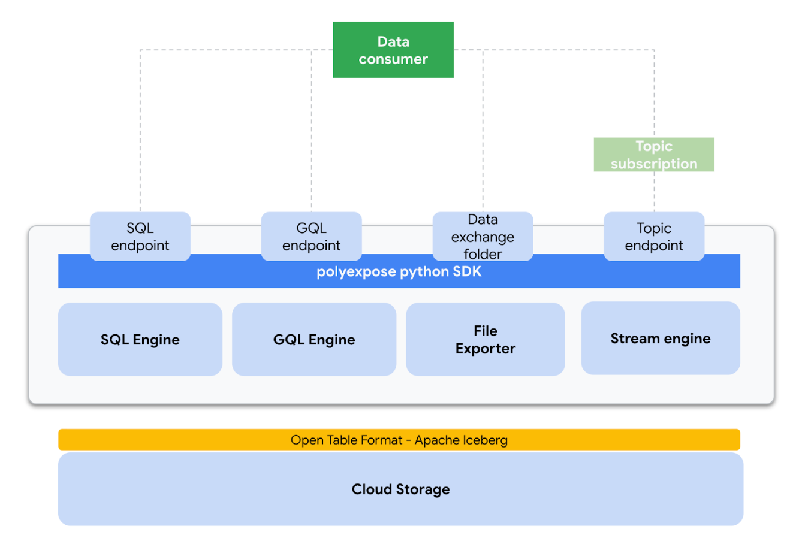

# Dissecting the Data Mesh technical platform : Exposing polyglot data

keywords: **[datamesh, polyglot, apache iceberg, spark, SQL,GQL]**

## `polyexpose` installation and usage
Follow steps on `notebooks/polyexpose_demo.ipynb` for a detailed end to end demo.

The notebooks deploy GCP infraestructure using the terraform based bootstraping  utils located in `infra_deploy`

```bash
$> cd infra_deploy
$> . ./bootstrap_polyexpose_infra.sh config.yaml
```

## Context and motivation

No matter how we look at it, **data consumption** is perhaps one of the central user journeys of any data platform, if not the main one. Consuming data somehow represents the culmination of all the multi-team efforts put into the platform over time: data ingestion, cataloging,  transformation or quality control just to name a few. Data consumption is the final delivery for data teams.

Ironically, data consumption is also one of the areas that generates more friction between central IT data teams - the teams responsible for building the data platform and model its contents - and the data consumers embedded into the business areas - responsible for consuming the data and generating insights that ultimately can turn into business value.

On one hand data consumers expect the data to be workable from day one with little to none adaptation effort, data needs to be in their “native” format, the format in which they are used to work with. And on the other hand, the central IT teams are incentivized to generate a unique and standardized way of data consumption, more often than not heavily influenced by the data platform underlying technology.

The result tends to be suboptimal, with a more or less canonical way to access the data that in the end requires extensive plumbing and transformation downstream in the business areas.


The Data Mesh paradigm recognizes and appreciates this tension and takes a very clear position in its resolution: **it definitely stands up for the data consumers**. Rather than imposing a standardized way to work, the platform should adapt to their user needs and offer the data in the most convenient way - native feeling.

Data Mesh means decentralization in essence, so the solution can be quite simple:  to dilute the consumption responsibility into the business areas themselves, acquiring the responsibility for generating data into their native format in the data products under the business domain they own. But as the mesh grows so do its inter-domain use cases, and more often than not, different teams will need data in different formats.

With the ultimate goal to ensure reusability, Data mesh answer is to introduce the concept of **polyglot data**, an abstraction to clearly differentiate between the data semantics and the data consumption format / syntax.


This is a very elegant approach with a very clear separation of responsibilities between semantics and its underlying technology, but as Data Mesh does not prescribe any kind of technical architecture, sometimes this can be challenging to visualize or implement.

The idea of this repository is to present a potential technology architecture that implements this pattern using as many open source components as possible.

## A polyglot data framework MVP on Google Cloud : `polyexpose`

So, to illustrate these concepts I have built a simplistic python package (not production ready!)  that deploys ,orchestrates and automates data serving  with different syntaxes making use of different cloud technologies. The main idea is to bundle this package code with the desired data product to the internal data representation and then letting the consumers choose their preferred consumption format.


Inside Data Mesh, the central data team role shifts from “full control” to a more “platform engineering” view. So, I believe building components like this one to enable generic software developers in the business team to fully embrace the data-driven benefits could be one of the key OKRs for this team under this new paradigm.

So in order to define the different data syntax, I have come up with three different consumption personas that I believe are fairly generic and can be found in almost every organization.

* Data analysts - Used to work with SQL as their primary data interface
* Data application developers - APIs are the golden standard for application developers, thus we should respect that and offer an API interface to data - GQL. Another common pattern is based on event driven architectures.
* Data scientists - As part of the experimentation lifecycle, Data Scientists are used to load plain text files, this can be seen as an anti-pattern from the IT department lens, but the Data Mesh approach recognizes and celebrates the heterogeneity of data consumption patterns.

## Internal polyexpose architecture

With these patterns in mind, our data exposure framework should support the following data access mechanisms.

* SQL
* GQL
* CSV
* EVENTs

An initial architecture blueprint could look like this:



Lets now dig in every component

* **Primary data storage:** At the very core of the implementation, I have chosen Apache Iceberg as the internal table  format for analytic tables. Iceberg is tightly integrated with engines  like Spark and brings a number of great features like schema evolution, time travel, hidden partitioning or scan planning and file filtering. The Iceberg tables are deployed on Google Cloud Storage.
* **SQL interface:** Since we are using Iceberg for internal data representation, SPARK SQL seems to be the default choice for exposing a SQL engine to end users. We basically use a GCP dataproc cluster where a number of predefined spark templates are already deployed, the SPARK SQL execution is one of them.


* **GQL interface:** This one is a bit more tricky to implement as under the hood the GQL interface is exposed using hasura graphQL engine. At the time of development, hasura supported backends are Postgres and BigQuery, so when exposing data via the GQL interface there is and additional step that copies the data from GCS / Iceberg to BigQuery, then using the hasura API we generate a new connection to BQ and track the data.


* **CSV interface:** We just use SPARK for mutating the dataframe format, reading the Iceberg Tables and writing in plain CSV also in Google Cloud Storage.


* **Events interface:** This expose mode uses a pubsublite topic (KAFKA compatible) in conjuction with SPARK Structured streaming to offer the data in a real time event fashion. It needs the client to generate a susbcrption to the topic.


## Future work

This repository contains just a inspirational architecture for exposing data in different syntaxis, but it is far for being a productive solution, requiring extensive work on security or access controls unification just to name a few areas. Apart from that other interesing areas Id looking into the future are:

* Implementation of data contracts
* Implementation of global policies on different technologies

## Contributing

Pull requests are welcome. For major changes, please open an issue first to discuss what you would like to change.

Please make sure to update tests as appropriate.
